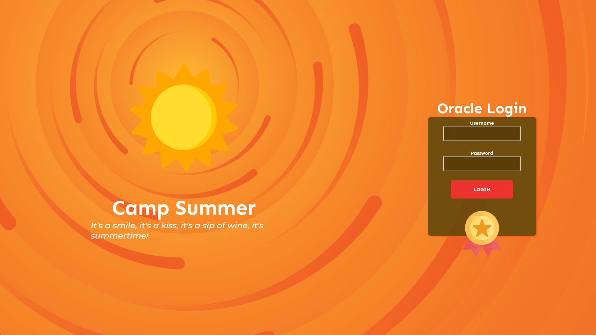
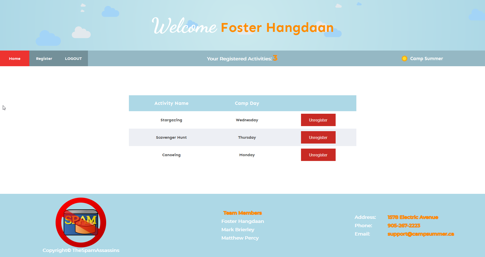
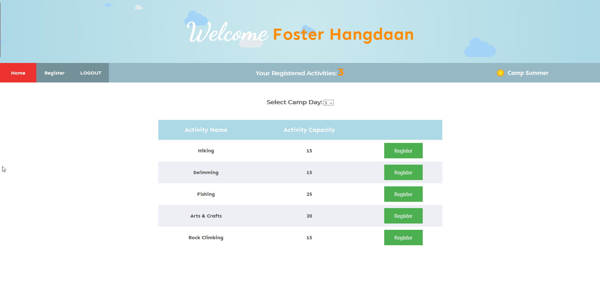

# OLS655 - Database Design Project
*Made in the winter of 2020 (Jan. - Apr.) semester for the course, OLS-655: Online Systems, at Seneca College of Applied Arts and Technology in Toronto, Ontario.*

This group project is the culmination of the database design techniques taught in OLS655. The project involved designing an Oracle SQL database that stores the registration information for a fictitious Camping website. The server-side interaction with the database was written in C#. The front-end user interfaces were initially made in Visual Studio 2012 then further enhancements were done through manual editing of the CSS and HTML code.

The Visual Studio project name was named under our fictional company, The Spam Assassins.
## Developers
- [Foster Hangdaan](http://www.fosterhangdaan.com)
- Mark Brierley
- [Matthew Percy](https://percy.tech)

## Screenshots
### Login Page

### Home Page

### Registration Page

